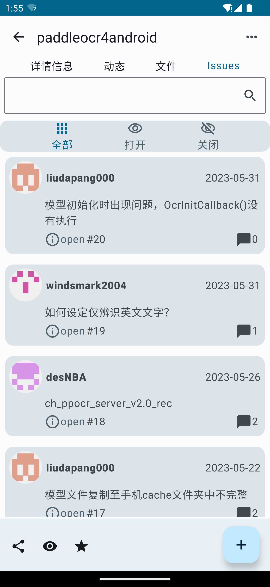

# 简介

这是一款灵感来自于 [gsy_github_app_flutter](https://github.com/CarGuo/gsy_github_app_flutter) 的开源 GitHub 客户端 APP，使用 Jetpack Compose 编写。

**目前还在编写中，所以部分功能可能尚不可用。**

# 截图

|                        |                        |
|:----------------------:|:----------------------:|
|  |  |
|  |  |
|  |  |
|  |                        |

更多功能请自行下载后体验。

# 使用

## 编译运行流程

> 以下介绍引用自 [gsy_github_app_flutter](https://github.com/CarGuo/gsy_github_app_flutter)

**重点：** 你需要项目根目录下，配置 `local.properties` 文件，然后输入你申请的Github client_id 和 client_secret。
```text
ndk.dir="xxxxxxxx"
CLIENT_ID = "xxxxxx"
CLIENT_SECRET = "xxxxxx"
```

[注册 Github APP 传送门](https://github.com/settings/applications/new)，当然，前提是你现有一个github账号。

### 3、现在 Github API 需要使用安全登录（授权登录），那么在上述注册 Github App 的 Authorization callback URL 一栏必须填入 `gsygithubapp://authed`

<div>


</div>